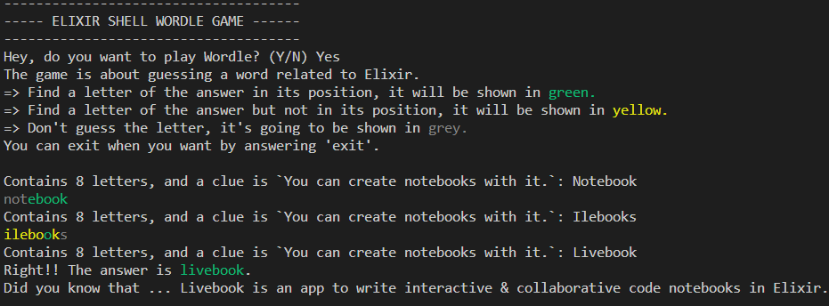

# ElixirTerminalWordle

**ElixirTerminalWordle** allows you to play a version of ``Wordle`` where all the **words are related to Elixir**.

Do you dare to try a game? :) 



## How to play?

### QuickStart Installation

- **Step 1**: Install [Elixir](https://elixir-lang.org/install.html). As a prerequisite for elixir installation, you have to have [Erlang](https://www.erlang.org/downloads.html) installed (> 0.23).

- **Step 2**: Download the project. 
  - `git clone https://github.com/IciaCarroBarallobre/ElixirTerminalWordle`
- **Step 3**: Go to the project folder and install Mix dependencies.
  - 1. Go to the project folder:
    - Windows: ``dir ElixirTerminalWordle``
    - Linux: `cd ElixirTerminalWordle`
  - 2. Install the dependencies: `mix deps.get`.

If you have any problem, please let me know in the issues page of the project. The most common issues are solved on [#Troubleshooting](#troubleshooting).

### QuickStart

To **play on Windows**, open a terminal in the project folder and:

```elixir
> iex.bat -S mix #Windows

iex > WordleTerminalGame.start()
```

To **play on Linux**, open a terminal in the project folder and:

```elixir
> iex -S mix 
iex > WordleTerminalGame.start()
```

If you have any problem, please let me know in the issues page of the project. The most common issues are solved on [#Troubleshooting](#troubleshooting).

### Documentation

You can generate the documentation running `mix docs`, which uses `ExDocs` library specified in the dependencies.

This documentation is going to be generated under the `/docs` folder (with the `.html` extension).

### Troubleshooting

(TO-DO)
