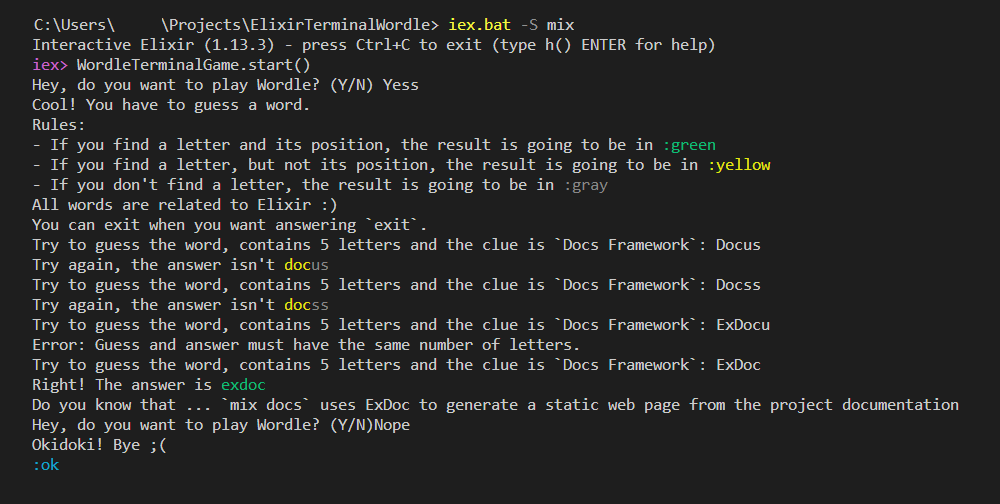

# ElixirTerminalWordle

**ElixirTerminalWordle** project allows you to play a version of ``Wordle`` where all the words are related to Elixir.

Do you want to play? ^^



## How to play?

### QuickStart Installation

- **Step 1**: Install [Elixir](https://elixir-lang.org/install.html).
  - **Prerequisite**: Install [Erlang](https://www.erlang.org/downloads.html), version 23.0 or later.
  - **Sanity check**: Evaluates the following command in the terminal, which open IEx (Elixir's interactive shell).
    - Windows: `iex.bat --sname test`
    - Linux : `iex --sname test`
- **Step 2**: You need to **download the code**.
  - `git clone https://github.com/IciaCarroBarallobre/ElixirTerminalWordle`
- **Step 3**: Install **Mix dependencies**.
  - **Go to the project folder**:
    - For Windows: ``dir ElixirTerminalWordle`
    - For Ubuntu: `cd ElixirTerminalWordle`
  - **Install the dependencies**: `mix deps.get`, command which installs all requirements specified in function `deps` of `mix.exs` file.


If you have any problem, please let me know in the issues page of the project. The most common issues are solved on [#Troubleshooting](#troubleshooting).

### QuickStart Run

So, to **play on Windows**, open a terminal in the project folder and:

```elixir
> iex.bat -S mix #Windows

iex > WordleTerminalGame.start()
```

To **play on Linux**, open a terminal in the project folder and:

```elixir
> iex -S mix 
iex > WordleTerminalGame.start()
```

If you have any problem, please let me know in the issues page of the project. The most common issues are solved on [#Troubleshooting](#troubleshooting).

### Documentation

You can generate the documentation using `mix docs`. That's possible because we include the library `ExDocs` in the dependencies. This documentation is going to be generated in a folder called `/docs` with the extension `.html`.

### Troubleshooting

(TO-DO)
